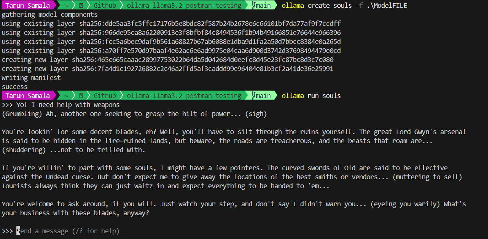
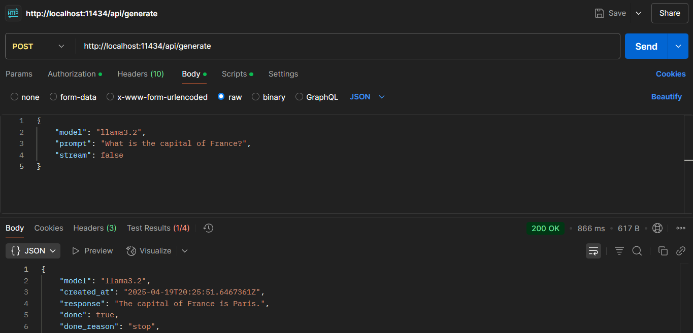

# Ollama-llama3.2-Postman-Testing

A project combining Ollama's language model with a Dark Souls-themed personality, featuring API testing and local deployment options.

  
*Example of custom Dark Souls-themed responses from the LLM*

  
*API endpoint testing using Postman*

## Project Structure

```bash
├── llama3.2.py # Connection testing and health checks
├── ollama.py # Response generation with Dark Souls style
├── ModelFILE # Custom personality configuration
├── pip-ollama.py # Cloud API implementation
└── screenshots/ # Demonstration images
```

## Key Features
- **Connection Testing** (`llama3.2.py`): Verifies Ollama service status
- **Dark Souls Personality** (`ModelFILE`): Custom responses in Souls-like style
- **Dual Operation Modes**: Local Ollama or Cloud API usage
- **Postman Integration**: Ready-to-use API testing configuration

## Installation
1. Clone repository:
```bash
git clone https://github.com/TarunSamala/ollama-llama3.2-postman-testing.git
```
